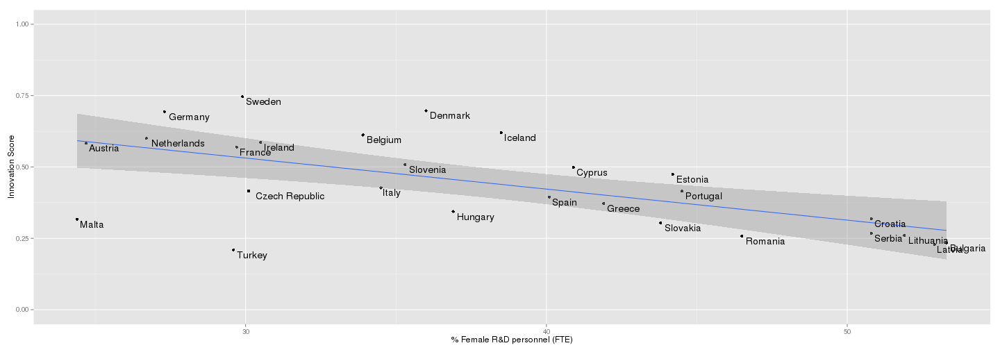
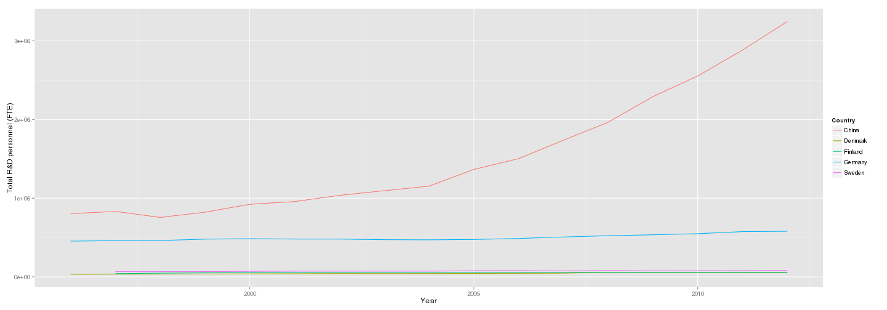

EU Innovation Scoreboard and UNESCO investments in R&D Personnel
========================================================
author: C9 - Developing Data Products
date: 20 JUN 2015

Introduction 
========================================================

The interactive Shiny application provides a simple explorer of the EU Innovation Scoreboard data vs Research and Development Personnel across certain countries. Two datasets were combined in a preprocessing step:  
* [UNESCO Science, Technology and Innovation indicator](http://data.uis.unesco.org/index.aspx?queryid=63&lang=en) 
* [EU Innovation Scoreboard data](http://ec.europa.eu/enterprise/policies/innovation/files/ius/ius-2014-database_en.xlsx"")

Available Indicators and Data
========================================================
The UNESCO dataset contains 44 R&D Personnel indicators out of which only a small subset has been select. In combination with the EU Innovation Scoreboard data the following plots can be generated: 

* Barcharts of EU Innovation Score or Total R&D Personnel for given year
* Time series of Innovation Scores or R&D Personnel for selected countries
* Scatterplots of Female or Total R&D Personnel by Innovation Scores 

**FTE** refers to Full Time Equivalent and **HC** refers to Head Count.

Innovation leaders vs. % Female R&D Personnel 
========================================================
Among the most interesting scatterplots it the relationship between countries innovation score vs. the percentage of female R&D personnel which exhibits a strong negative linear relationship. 

 

Growth of Investment in R&D Personnel
========================================================
Among the countries with the most spectacular growth in R&D Personnel is China, here displayed in relation to the group of EU Innovation leaders (Sweden, Germany, Finland, Denmark)

 

